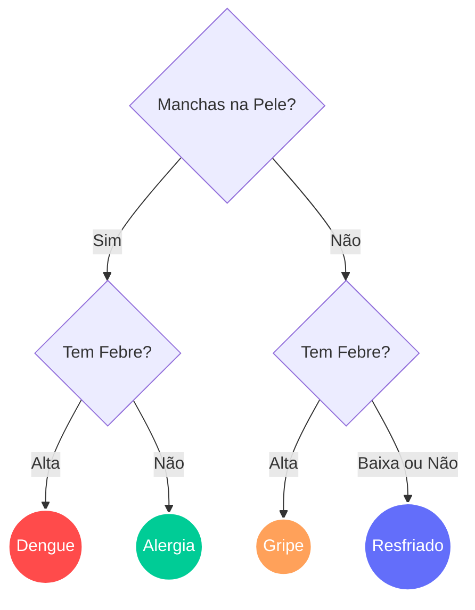

# Sistema de Diagnóstico IA - Árvore de Decisão (2026)

  

  

  
  
  

  
  
  

---

## 📌 Sobre o Projeto
Este repositório contém uma aplicação web interativa desenvolvida como atividade da disciplina de **Inteligência Artificial** (Prof. Dr. Lucas Hermann Negri). 

O projeto implementa um modelo clássico de **Árvore de Decisão** para realizar triagem médica. A partir da análise de um conjunto de regras (sintomas), o algoritmo foi otimizado para classificar a doença (Gripe, Resfriado, Dengue ou Alergia) realizando o menor número possível de perguntas ao paciente.

## 🌳 Lógica da Árvore de Decisão

O diagrama abaixo ilustra a estrutura lógica otimizada pela IA, descartando sintomas redundantes (como tosse e coriza) para agilizar o diagnóstico:

---

## 🚀 Como acessar
A aplicação está hospedada na nuvem e pode ser acessada diretamente pelo navegador através do link abaixo:

## [🔗 Acessar Sistema de Diagnóstico (Streamlit)](https://sistema-diagnostico-ia.streamlit.app/)

## 🧑‍💻 Autora

| Nome                        |                                                      GitHub                                                      |                                                                  LinkedIn                                                                  |                                                             Instagram                                                             |
| :-------------------------- | :--------------------------------------------------------------------------------------------------------------: | :----------------------------------------------------------------------------------------------------------------------------------------: | :-------------------------------------------------------------------------------------------------------------------------------: |
| **Talita Mendonça Marques** |  |  |  |

 

Licenciatura em Computação 
Instituto Federal de Mato Grosso do Sul - <b>Campus Jardim</b>

## ⚖️ Licença

Este projeto está licenciado sob a Licença MIT. Veja o arquivo [LICENSE](LICENSE) para mais detalhes.

---

⭐ Se este projeto foi útil para você, considere deixar uma estrela no repositório!

_Projeto desenvolvido com ❤️ por [Talita Mendonça Marques](https://github.com/skyzinha-chan)._